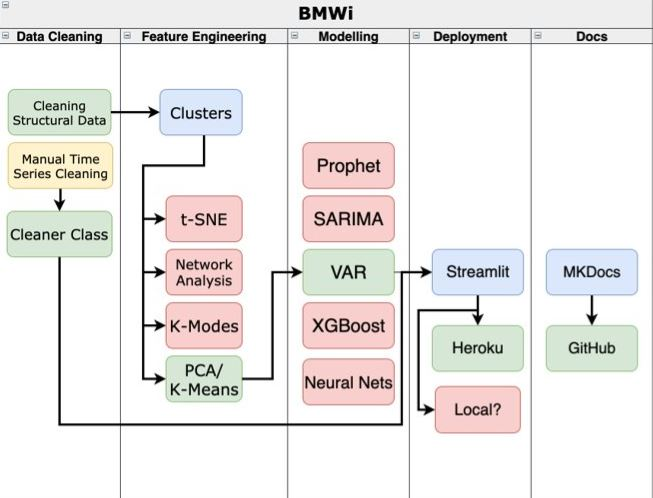
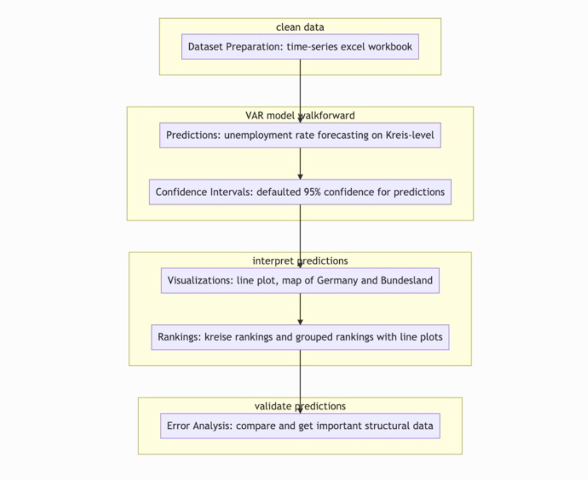
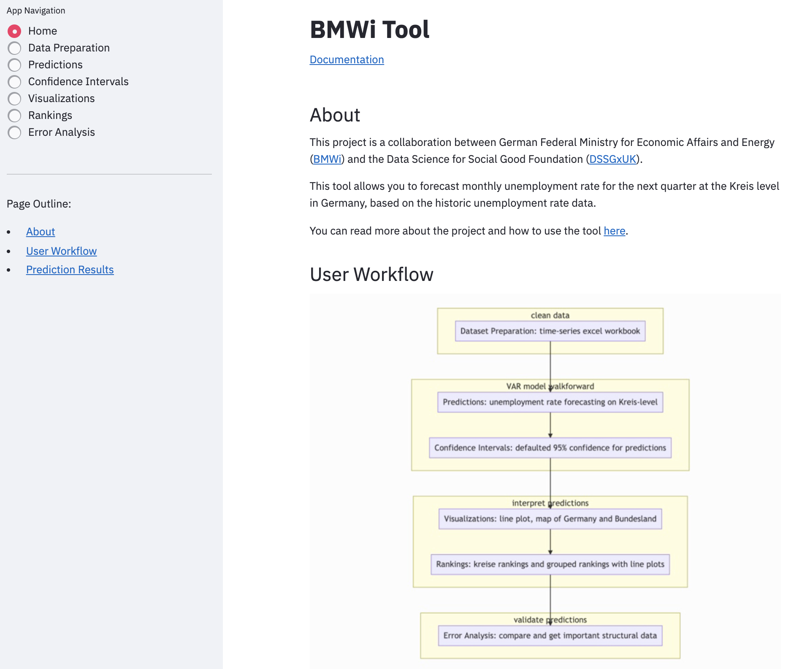

# 📊 BMWI Prediction and Visualisation Tool 

## 📖 Resources 

You can find all the relevant links for project here:- 

* **Regional Unemployment Forecasting Tool**: [here](https://bmwi-tool.herokuapp.com/)

* **Documentation**: [here](https://dssgxuk.github.io/bmwi/) 

* **Video Tutorials**: The tutorials to understand how the application works can be found [here](https://www.youtube.com/playlist?list=PLzWRWFPEUpHbwIHq0T6M72B1_5N04hD0Q)

## 🚀 About the Project 

This project is a collaboration between [German Federal Ministry for Economic Affairs and Energy (BMWi)](https://www.bmwi.de/Navigation/EN/Home/home.html) and [Data Science for Social Good Fellowship, UK](https://warwick.ac.uk/research/data-science/warwick-data/dssgx/). The goal of the project is to build a bottom-up forecasting model for predicting economic development in Germany based on regional data. The bottom-up approach focusses on the predictions at the Kreis (county) level rather than a federal level and provides an alternate approach to forecasting. The project draws on fine-grained data on the demographic, economic and sectoral structure of regions with the aim of improving economic forecasts during times of shocks. The unemployment rate in the different regions of Germany has been used as a proxy for the economic development in that region. 

## 🧰 About the tool 

This is a forecasting tool built using Streamlit to forecast the unemployment rate for the next three months at the Kreis level in Germany. The purpose of the tool is to provide a complete pipeline from data analysis to model predictions in a simple easy-to-acess UI.

## Project Overview

The following diagram shows the tool architecture which includes the data processing, predictions and deployment.

<!-- ## 🧩 Components

The different components of the this application are:

 -->

## 🖥️ Dashboard

The dashboard of the tool is built using [Streamlit](https://streamlit.io/). 

## ⚡ How to Run 

* Clone the repository - `git clone https://github.com/DSSGxUK/bmwi.git`
* Install the dependencies - `pip install -r requirements.txt`
* Run the application - `streamlit run app.py`

## ⚒️ Contributors 

The **fellows** undertaking this project are: 

<table>
  <tr>
    <td align="center"><a href="https://github.com/amitSasson"> <b>Amit Sasson</b></a> </td>
    <td align="center"><a href="https://github.com/CinnyLin"> <b>Cinny Lin</b></a> </td>
    <td align="center"><a href="https://prakharrathi25.netlify.app/"> <b>Prakhar Rathi</b></a> </td> 
    <td align="center"><a href="https://github.com/VighneshNatarajanGanesh"> <b>Vighnesh Natarajan Ganesh</b></a> </td> 
  </tr>
</table>

The **mentors** for this project are:

<table>
  <tr>
    <td align="center"><a href="mailto:doschmund.kwiatkowski@gmail.com"> <b>Doschmund Kwiatkowski</b></a> </td> 
    <td align="center"><a href="https://www.linkedin.com/in/yurii-tolochko-050376162/"> <b>Yurii Tolochko</b></a> </td> 
  </tr>
</table>
