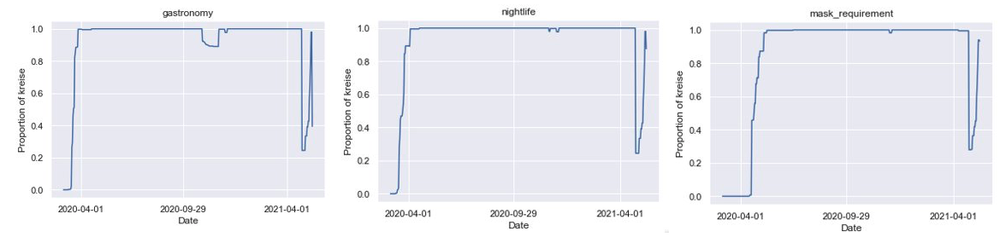

# Covid19 restrictions 

We wanted to estimate the causal effects of decisions on unemployment rate, but because these decisions were not random, we couldn't just compare the groups. Therefore, we wanted to use IPTW to balance the groups. The idea is to give a higher weight to observations that got the decision they were not "supposed" to get. However, this did not work. 
For some of the decisions (e.g. closing restaurants), all kreise made the same decisions simultaneously, therefore we can't estimate the effect of these decisions.  

For other decisions (e.g.  curfew), not all kreise made the same decisions simultaneously, but the kreise were perfectly separated. For example, weights were calculated using logistic regression, for predicting of a kreis that will force curfew, based on all other features available, but almost each weight was 0 or 1. All kreise in one group were fundamentally different then all kreise in the other, thus even the weights couldn’t help. 
Therefore, the causal effects can't be estimated.
