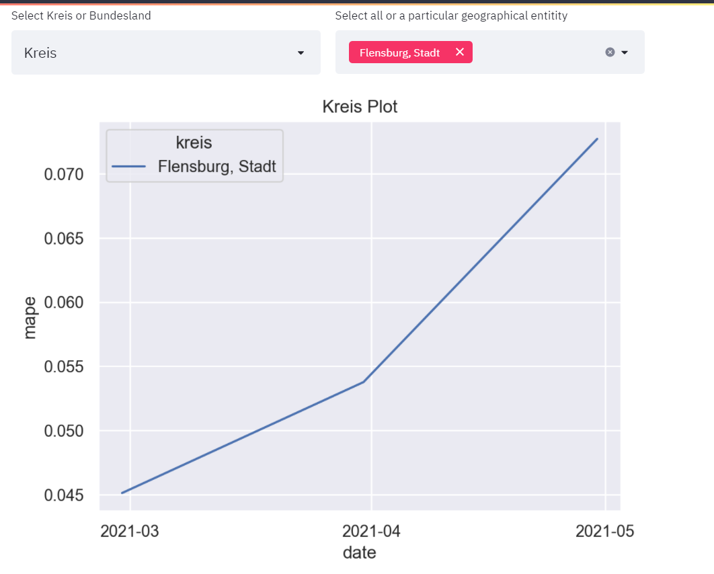
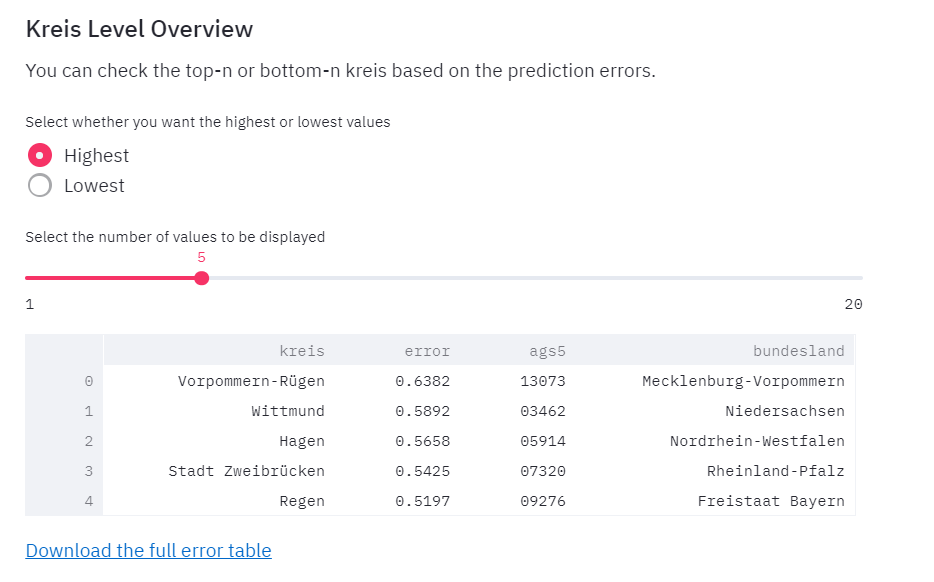
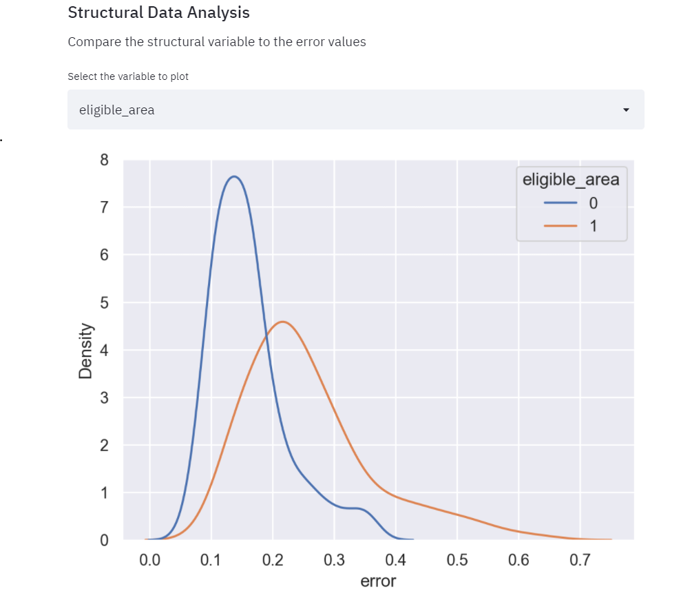

# Error Analysis

There error analysis is an attempt to see where the unemployment rate predictions “fail”. 
The errors are [Mean absolute percentage errors (MAPE)](https://en.wikipedia.org/wiki/Mean_absolute_percentage_error), and each one represent how different the prediction is from the ground truth. The errors can be used to see which kreise were difficult to predict for, potentially suggesting the something spacial happened there. The errors can also be easily compared with the structural data, to identify the type of kreise that are harder to predict for. 

### Video Documentation 

The following video will walk you through this section and how to use the various interactive widgets. 

<iframe width="560" height="315" src="https://www.youtube.com/embed/watch?v=gSpz9Lcbl7A&list=PLzWRWFPEUpHbwIHq0T6M72B1_5N04hD0Q&index=7" title="YouTube video player" frameborder="0" allow="accelerometer; autoplay; clipboard-write; encrypted-media; gyroscope; picture-in-picture" allowfullscreen></iframe>

**Note:** To calculate the errors the actual values must be available. Therefore, the errors are calculated for the previous quarter based on the recently uploaded data and, hence, this is a retrospective analysis. 
### Launching the page

To open the error analysis page, select the 'Error Analysis` Section from the dropdown on the left as can be viewed in the image below.  

There are a variety of different plots that can be explored and have been explained in detail below. 

<!-- ## Map Visualisation 

This is the first step of visualisation that one can view. Select the checkbox `Visualize error on a map?`. This will toggle open the following section. 

Here, you will see the `average` option selected by default. This will make a map with the average value of errors. This average is calculated over all the dates of the predictions. On clicking on the dropdown and selecting a specific date, the errors for that date will be plotted as seen below. 

 -->

## Error Plots by Bundesland or kreis 

This section allows for a kreis-level or bundesland-level analysis. The left dropdown allows selection by Kreis or by Bundesland and the right dropdown allows selection of one or more regions. 

 Selecting an individual entry would plot the errors for a specific kreis or bundesland. You can select multiple bundesland or kreis. The individual entries can be selected from the right dropdown option. 

## Map Overview 

Another option is to plot the errors on a map of Germany. 
You can add the kreis name and the error of that 
kreis will be added to the map based on your 
selection. 

## Kreis Level Overview 

The goal of the application is to break down the predictions as well as the errors at the Kreis level. The following section performs error data analysis. It helps in understanding which Kreis are the hardest to estimate for unemployment rate. 

*This dataframe currently shows 5 kreis based on their unemployment rate forecasting errors for <strong>previous</strong> quarter.*

There are two configuration options here:
- `Highest or Lowest`: This lets you select the Kreis with the highest or lowest unemployment rate prediction errors in the previous quarter. 
- `Value Slider`: This lets you select the number of Kreis to be displayed currently. *From UI perspective, the maximum limit is 20* 

To view all the Kreis, download the complete error table by clicking on the option `Download the full error table`. 

## Structural Data Analysis 

The next step is to analyze the errors with regards to the structural data and see hot the errors vary with a particular structural variable. Select a structural variable to compare against the errors. (*Eg: Errors are compared against `eligible_area` in this image*).

If you chose a categorical variable, the errors are on the x-axis, so the fatter the curve is the more prone that category is to errors. In the following example, the areas which are eligible have smaller errors than areas that are not. This means that it is easier to predict kreise that are eligible for funding then kreise that are eligible. This might be because something unique happened in the eligible kreis that the model can’t explain. 

If you chose a numerical variable, each kreis will be plotted at a seperate dot, and if there is any relationship between the errors and the variable, you might be able to see it in the plot.

### Most important Structural Variables 

Individual exploration might be interesting but can also be very time consuming. There is an option to get an overview of which features correlate to the errors and therefore explain the variance in the errors well. 
The features are selected using a linear regression. We fit a linear regression where the predicated value is the mean error of the kreis, and the regressors are all the structural features. 
We chose the most important features based on P-value, and also print the P-values. 

To run the regression, tick the "run linear regression model" box. Then, you can choose how many features you wish to print. Also, chose if you are looking for the 
highest P-values (important features) or the lowest (not important features). 

