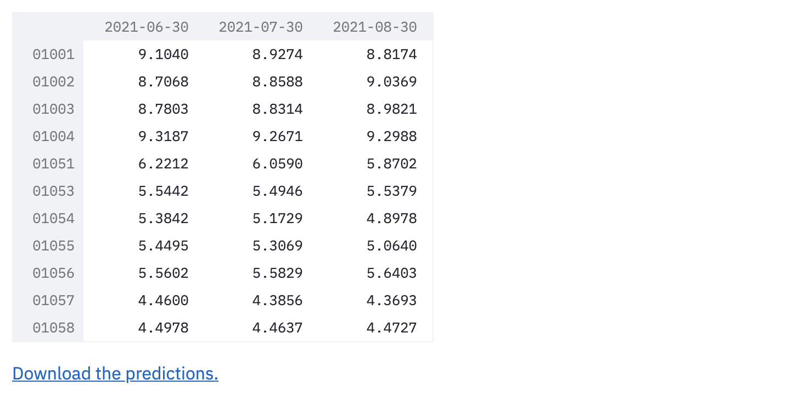
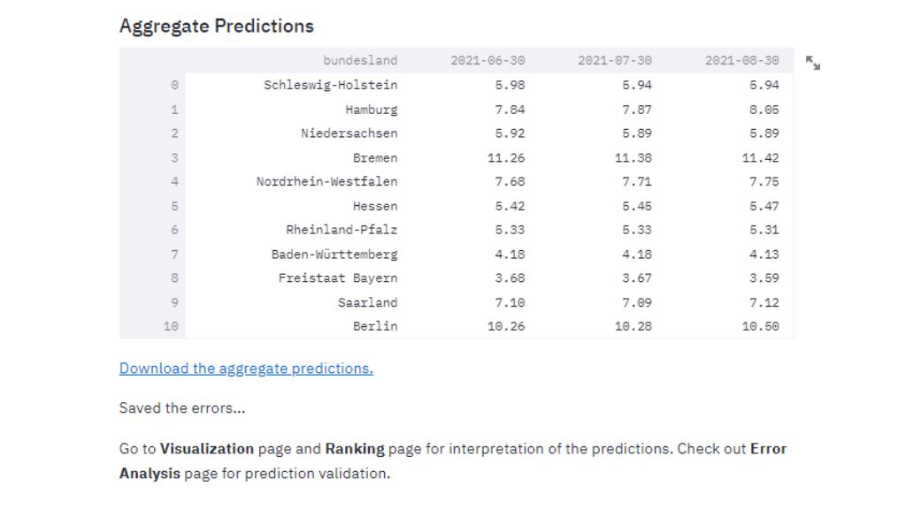

# Predictions 

This section focuses on getting the results from the model.
The results will include unemployment rate predictions the next three months, for all 401 kreise.

### Video Documentation 

The following video will walk you through this section and how to use the various interactive widgets. 

<iframe width="560" height="315" src="https://www.youtube.com/embed/BTVtRuKCUxU" title="YouTube video player" frameborder="0" allow="accelerometer; autoplay; clipboard-write; encrypted-media; gyroscope; picture-in-picture" allowfullscreen></iframe>

After the model it fitted, it is possible to download and visualize the predictions. 

## Fit Model and Export Predictions 
This page automatically takes the cleaned dataset and fits the model on it. 
The model being fitted is a [Vector Autoregression](https://en.wikipedia.org/wiki/Vector_autoregression) (VAR) model, which is a multivariate forecasting algorithm used when two or more time series influence each other. 

The model uses the [PCA & K-means]() clusters. More on the model and clusters is explained on [our journey](https://cinnylin.github.io/bmwi-docs/) the fitting might take a few minutes. After the model is fitted, a preview of the predictions table is showed. 

The table has three columns, each one holding the unemployment rate predictions for one month, and each row is a different kreis. 

After the model is fitted, it is possible to click the "Download the predictions" link and and xslx table with the predictions will be downloaded. 

### Aggregation of Predictions

The predictions from the County level are aggregated to the Bundesland and Country level using a weighted mean, weighted on the population of the kreise. 

NOTE: The populations used to aggregate are data from the timeframe: December 31, 2018 - December 31, 2019, collected from [corona-datenplattform](https://www.corona-datenplattform.de/dataset/bevoelkerung).
