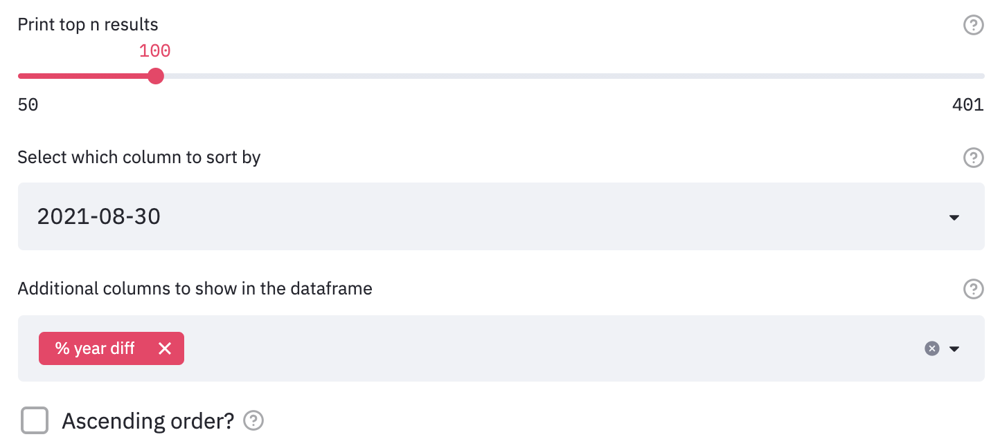

# Unemployment Rate Ranking

The ranking page allows you to get quick takeaways based on the latest prediction results. 

The main feature of this page is to quickly see which kreis (or which group of kreise) are expected to have the highest (or lowest) unemployment rate for the next quarter.

## Kreise Ranking
The first section is kreise ranking, containing four elements:

### Slidebar

The slide bar allows you to see the top N kreise with the highest unemployment rates. It is set in a range from 50 to 401, in increments of 50. The default is set at 100.

### Sort-by Columns

Then, you need to choose which column to sort by 

The options are: 

- A specific ground truth month

- A specific predicted month

- Difference in unemployment rate compared to last month (`month diff`)

- Difference in unemployment rate compared to this month last year (`year diff`)

- Percentage of change in unemployment rate compared to same time last month (`% month diff`)

- Percentage of change in unemployment rate compared to same time last year (`% year diff`)

 <!--- An average of the three predicted month (``) -->

### Additional Columns

This is a multi-selection input field where you can choose multiple columns you want to also see in the sorted dataframe.

### Ascending order?

It is automatically printied in an descending order. If you tick the "ascending order" box, it will order by ascending order.  

### Results

After setting the number of top kreise you want to filter in, the column you want to sort by, and the additional information you want to see, you are presented with the dataframe output of your choosing. You also have the choice to download that specific subset of the dataframe.

## Grouped Ranking

The second section is categorical group ranking, following up the dataframe we used in the previous section:

### Group-by columns

This multi-selection box offers a range of categorical variables to group by. The options include:

- `bundesland`: the states in Germany

- `growth_shrink_cities` ("wachsende/schrumpfende Kreise")

- `east_west` ("West-/Ostdeutschland")

- `labor_market_type` ("IAB-Arbeitsmarkttyp der Arbeitsagentur")

- `settlement_type_of_labor_market_region` ("Siedlungsstrukturtyp der Arbeitsmarktregion")

- `district_settlement_structure` ("Siedlungsstruktureller Kreistyp")

- `type_of_settlement_structure` ("Siedlungsstruktureller Regionstyp")

- `urban_rural` ("Städtischer Raum / Ländlicher Raum")

- `support area status` ("Gemeinschaftsaufgabe Verbesserung der regionalen Wirtschaftsstruktur")

- `eligible area`: binary variable based on `support area status`

- state area code (Amtlicher Gemeindeschlüssel, "`ags2`") / state-level ("`bundesland`")

*The default is set to group by both `east_west` and `eligible area`.*

### Results

The filtering result is a multi-index dataframe with three columns. The multi-index is presented based on how many columns you group by. The three columns include: 

- `{sort_by_column}`: the column to sort by in the filtering dataframe. The default is set to sort by its percentage change compared to `last_year%`.

- `#kreis`: the number of kreise in that grouping.

- `%count`: the proportion of kreise belonging to that sorted grouping.

*For example, this sample dataframe shows the top `100` kreise, sorted by `last_year%`, grouped by `east_west` and `eligible area`.*

<i>

Reading the first row: 

<ul style="color:gray">
    <li> the first column, `last_year%`, means that in the top 100 kreise with highest percentage change in unemployment rate compared to last year, `43` of them belong to kreise in west Germany that are eligible for funding.
    <li> the second column, `#kreis` means that there is a total of `93` (out of all 401) kreise that are kreise in west Germany that are eligible for funding.
    <li> the third column, `%counts`, means that 43 kreise accounts for `46.24%` of all the kreise in the eligible-for-funding-West-Germany group.
</ul>
</i>

_Note that the last row is `0`. **Sometimes, it could be useful to see what category groups are not in the top lists.** In this case, we see that there are no kreise in East Germany not eligible funding in the top 100 highest unemployment rates._

### Visualizations

Visualize the dataframe output results.

As explained in the tip, when grouping by multiple columns, resulting a large number of combinations, it may be hard to see the results clearly using the pie chart or bar chart.

#### Line Plot

*As shown above, the sample line plot visualizes the unemployment trend in each category group. For example, we can see that the east region historically always had higher unemployment rates than the west region. We can also see that the group eligible for funding also always had higher unemployment rate.s*

#### Pie Chart
The pie chart visualizes the `{sort_by_column}` into proportions.

*As shown above, the sample pie chart visualizes the percentage each category group takes in total from the `last_year%` column. For example, the not-eligible-for-funding-West-Germany group accounts for `43` out of the total of `100` top kreise, therefore, it takes up `43%` as shown in the pie chart.*

#### Bar Chart
As explained earlier, the pie chart could be a biased understanding of the category groups, and that can be balanced by understanding the percentage of those kreis accounting for the whole category group.

The bar chart visualizes the `%counts` column. It also draws a horizontal line on the 50% mark if at least one `%counts` column reaches that mark.

*As shown above, the sample bar chart visualizes the percentage the top 100 kreise took up for its whole category group. Note that you could use the two arrows on the top right to expand the plot if the display column names is too small on your screen.*

<!-- ^ Are there other things that should be added on the home page for quick access? -->