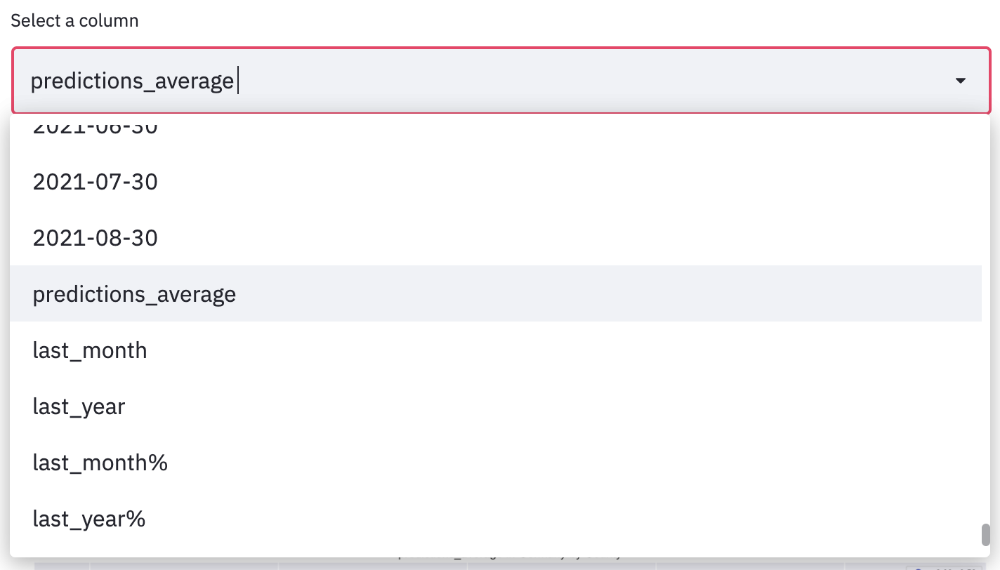
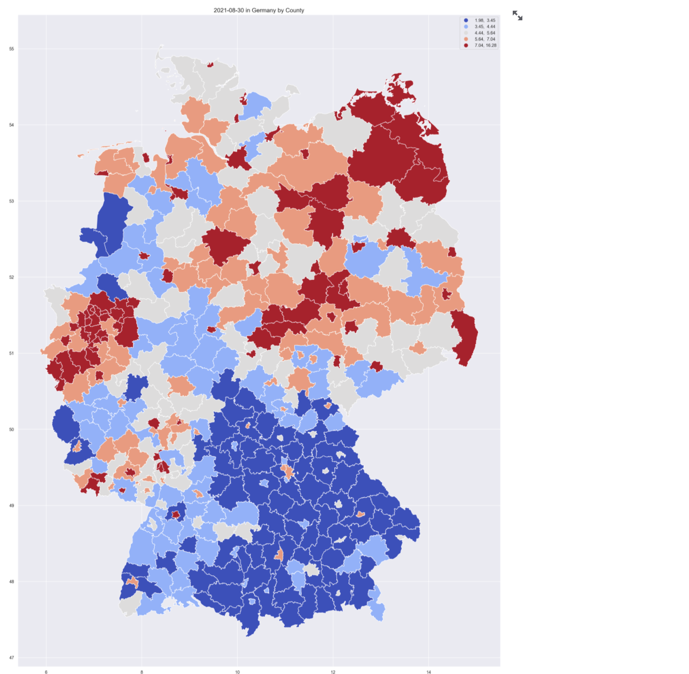
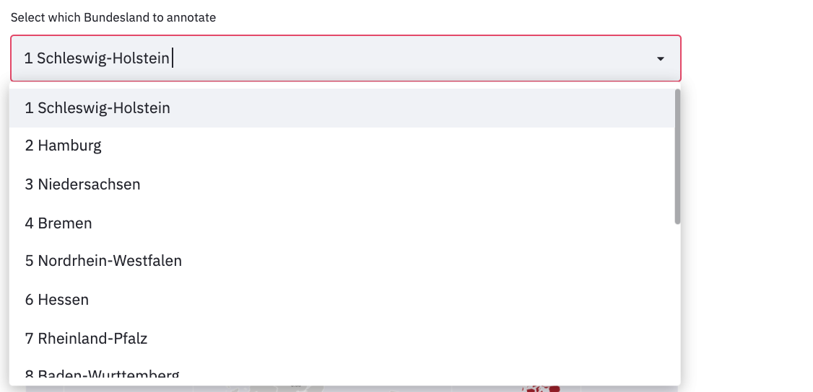

# Visualizations

This section allowas you to on see visualizations of the model results.

### Video Documentation 

The following video will walk you through this section and how to use the various interactive widgets. 

<iframe width="560" height="315" src="https://www.youtube.com/embed/watch?v=gSpz9Lcbl7A&list=PLzWRWFPEUpHbwIHq0T6M72B1_5N04hD0Q&index=5" title="YouTube video player" frameborder="0" allow="accelerometer; autoplay; clipboard-write; encrypted-media; gyroscope; picture-in-picture" allowfullscreen></iframe>

## Predictions Line Plot
A time series of the predictions of each kreis can be plotted. For that, you need to chose a kreis from the drop down menu, or type its name. Then the unemployment rate predictions will be printed, and a time series graph will be plotted. 

It is also possible to choose multiple kreise. Then, the unemployment rate predictions for each kreis will be printed separately, 
and a time series graph for all kreise will be plotted. 

The graph shows the values of each kreis in a different line. The ground truth unemployment rates in different colors on the left,  and the predicted values in red on the right. 

It is also possible to pick the start date for the graph, which is helpful if you are interested in a very short or long time period. 

## Predictions Map

### Choose variable to plot map 

Another option is to plot the unemployment rates on a map of Germany. 

First, you need to choose which unemployment rate to plot. 

The options are: 

- A specific ground truth month

- A specific predicted month

- Difference in unemployment rate compared to last month

- Difference in unemployment rate compared to this month last year 

- Percentage of change in unemployment rate compared to same time last month

- Percentage of change in unemployment rate compared to same time last year

- An average of the three predicted months 

*This is a kreis-level map of Germany based on unemployment rate on predicted for August 2021.*

### Adding labels to the map

You can add the kreis name and unemployment 
rate of that kreis will be added to the map 
based on your selection. 

#### add labels based on kreis  

After choosing a column, it is also possible to add labels of a specific kreis to the plot. 
For that,choose a kreis from the drop down menu or type its name. The label of the kreis will be added to the map, along with the value. 

#### add labels based on bundesland  

It is also possible to look at a map of a specific bundesland. 
First, you need to choose which unemployment rate to plot. 

Then, chose a bundesland from the drop down menu or type its name. 
Automatically, the kreise with the highest values will be marked and their values will be plotted. 
It is possible to add labels of a specific kreis from this bundesland to the plot. 
For that, choose a kreis from the drop down menu or type its name. The label of the kreis will be added to the map, along with the value. 

