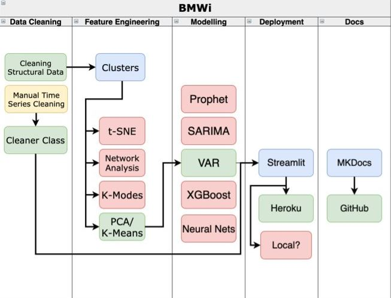

## About the tool 

This is a forecasting tool built using Streamlit to forecast the unemployment rate for the next three months at the Kreis level in Germany. The purpose of the tool is to provide a complete pipeline from data analysis to model predictions in a simple easy-to-acess UI. 

## Tool Architecture 

The following diagram shows the tool architecture which includes the data processing, predictions and deployment. 

## Streamlit Settings

Once you have started the tool, there are ways to customize your application.

- Start by selecting the dropdown on the top right of the page. 
- Go to `Settings`.

- Select `Wide Mode` if you want the application to appear in a wider format. You can also change the application colors by selecting the `theme` dropdown option. You can find the references for the application below. 

