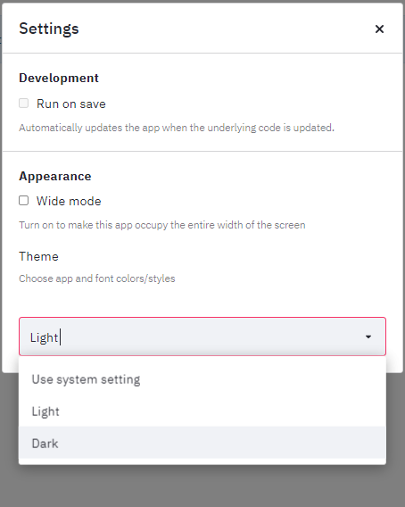

# Welcome to BMWi Forecasting Tool

## About the Project 

This project is a collaboration between [German Federal Ministry for Economic Affairs and Energy (BMWi)](https://www.bmwi.de/Navigation/EN/Home/home.html) and [Data Science for Social Good Fellowship, UK](https://warwick.ac.uk/research/data-science/warwick-data/dssgx/). The goal of the project is to robustify BMWI’s forecasts by developing a bottom-up forecasting model for predicting economic development in Germany based on regional data. The bottom-up approach focusses on the predictions at the Kreis (county) level rather than a federal level. The project will draw on fine-grained data on the demographic, economic and sectoral structure of regions with the aim of improving economic forecasts during times of shocks. 

<!-- ## About the Tool  -->

## Getting Started 

There are multiple aspects to be explored with this tool. Head over to [this page](start/start.md) to get started with the tool. 

## Streamlit Settings (Can be moved to a relevant section)

Once you have started the tool, there are ways to customize your application.

- Start by selecting the dropdown on the top right of the page. 
- Go to `Settings`
- Select `Wide Mode` if you want the application to appear in a wider format. You can also change the application colors by selecting the `theme` dropdown option. You can find the references for the application below. 

