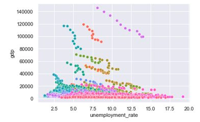

# GDP and Unemployment rate
We recived yearly data on GDP on a kreis level, 
and investigated the relationship it has to unemployment rate in a kreis level.
## Okun's law 

[Okun's law](https://en.wikipedia.org/wiki/Okun%27s_law) describes the relationship between changes 
in unemployment and changes in GDP. 
It assumes that the change in the unemployment rate, 
is approximately equal to 0. It also assumes that
the relative employment rate change, is approximately constant. 
Unfortunately, these assumptions don't hold in our data. 

## GDP and Unemployment rate linear correlation 
We investigated the relationship between the yearly GDP and yearly 
unemployment rate of 2008-2018. 
First, we plotted them for all kreise together, each kreis in a different color. 
We realised that there is no linear relationship. 

Then, we did the same with the change in GDP versus the change in unemployment rate. This means, for each year, the current value minus the previous year's value.
This did not yield a linear relationship either.

Then, we did the same with the relative change in GDP versus the relative change in unemployment rate. This means, for each year, the current value minus the previous year's value, divided by the previous year's value.
This did not yield a linear relationship either.

Finally, we ploted the GDP per capita, but this did not yield a linear relationship either.

To sum up, we couldn't find any linear relationship between yearly GDP and unemployment rate, 