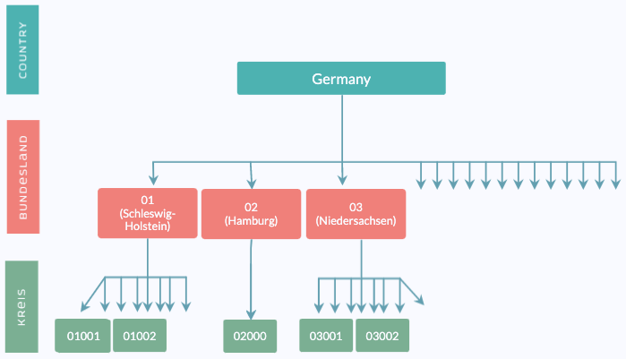
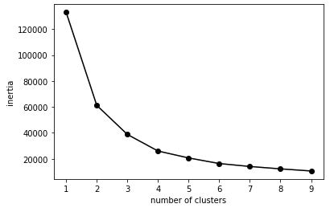

# Cluster Analysis 
This section talks about the clusters that we have built 
and used for the model. 

## Need for clusters 
We wanted to forecast unemployment rate for all 401 Kreise of Germany. 
Of course, we could have create 401 independent time series models, one for each Kreis. 
However, this would mean that all models won't learn from the unemployment rate time series of other Kreise. 
We believed that some Kreise must be similar to each other, 
and can benefit from incorporating each other's data in the forecasting process.

We used unsupervised classification methods to divide Kreise into clusters, 
based on 176 structural features collected during 2017-2018 for each Kreise. 
These clusters were later used in hierarchical time series models, and in VAR models.  

## Type of Clusters 
We explored 4 different methods to cluster the Kreise

### Bundesland

Each Kreise belongs to one out for 16 Bundeslands. 
Kreise that belong to the same Bundesland have a similar geographic location, 
and are also affected by the same decisions that are made on a Bundesland level. 

<!--  -->

### PCA & K-means

We started with clustering using 169 numerical features (disregarding the 7 categorical features). 

First, we reduced the features dimension using PCA 
with 3 components. 

1. The first component explained 53.0% of the variance of the features, 
and represented mainly the population size features. 
2. The second component explained 11.4% of the variance of the features, 
and represented mainly the rural vs. city features. 
3. The third component explained 4.7% of the variance of the features, 
and represented mainly the economical features. 

Then, we used K-means to cluster the Kreise into 3 clusters based on the PCA features. 

### tSNE

We started with clustering using 169 numerical features (disregarding the 7 categorical features). 

First, we reduced the features dimension using tSNE with 3 components. 

Then, we used K-means to cluster the Kreise into 3 clusters based on the PCA features. 

### K-modes

To incorporate categorical features as well, we also tried K-modes classification on the original 176 features, both numerical and categorical. 

## Cluster groups 

*Should we add a list of all kerise?*

*Should we add a map?*

### Bundesland

### PCA & K-means

### tSNE

### K-modes 