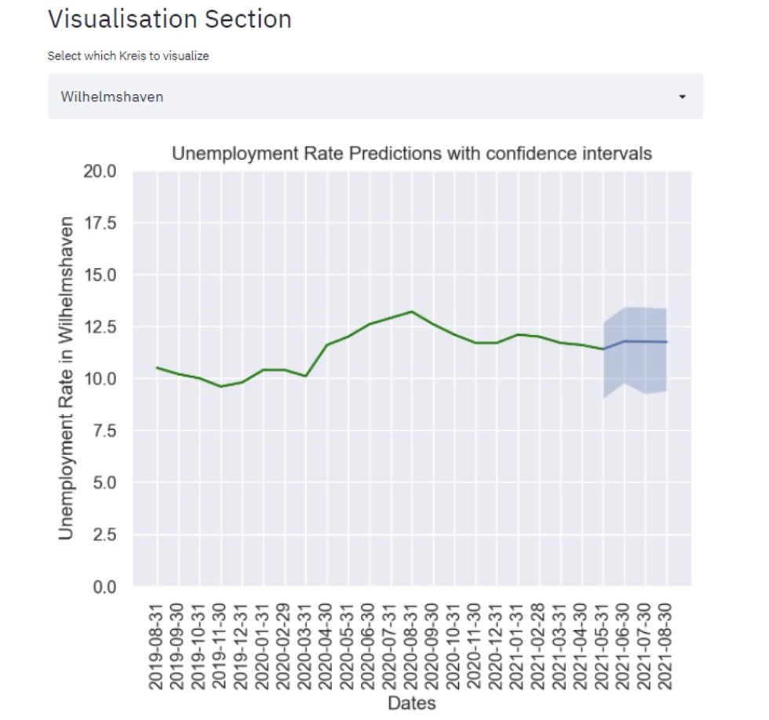

# Confidence intervals 

This section focuses on getting 95% confidence intervals for the predictions of the model.
The results will include unemployment rate confidence interval predictions the next three months, for all 401 kreise.

The confidence intervals are calculated using stationary bootstrap for time-series data, which uses blocks with an exponentially distributed lengths.
For more information see the [Arch package](https://arch.readthedocs.io/en/latest/bootstrap/timeseries-bootstraps.html
). 
## Fit confidence intervals
This page automatically takes the fitted the model, and calculates 95% confidence intervals for each forecast. 

After the confidence intervals are calculated, 
it is possible to click the "Download the confidence intervals" link and and xslx table with the confidence intervals will be downloaded. 

## Plot confidence intervals by kreis 

A time series of the predictions and confidence intervals of each kreis can be plotted. For that, chose a kreis from the drop down menu, or type its name. 
Then the unemployment rates will be printed, and a time series graph will be plotted. 
The last three values, which also have the confidence intervals plotted around them, are the predictions. 
All previous values are the ground truth values, and therefore don't require confidence intervals. 

