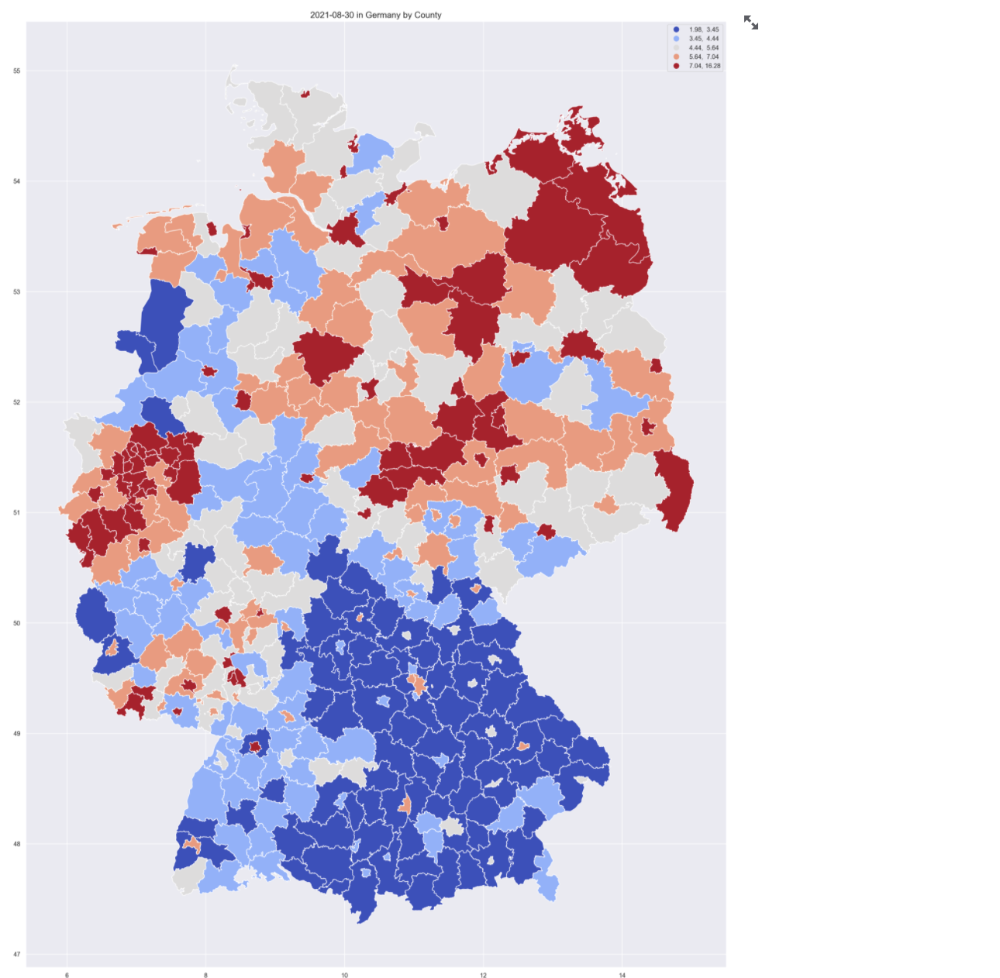

# Model Page 

This section focuses on getting the results from the model.
The results will include unemployment rate predictions the next three months, for all 401 kreise.
After the model it fitted, it is possible to download and visualize the predictions. 
## Fit Model and Export Predictions 
This page automatically takes the cleaned dataset and fits the model on it. 
The model being fitted is a [Vector Autoregression](https://en.wikipedia.org/wiki/Vector_autoregression) (VAR) model, which is a multivariate forecasting algorithm used when two or more time series influence each other. 
The model uses the [PCA & K-means]() clusters. More on the model and clusters is explained on [our journey](https://cinnylin.github.io/bmwi-docs/)

the fitting might take a few minutes. After the model is fitted, a preview of the predictions table is showed. 
The table has three columns, each one holding the unemployment rate predictions for one month, and each row is a different kreis. 

After the model is fitted, it is possible to click the "Download the predictions" link and and xslx table with the predictions will be downloaded. 

## Visualize prediction results

#### Predictions time series 
A time series of the predictions of each kreis can be plotted. 
For that, you need to chose a kreis from the drop down menu, or type its name. 
Then the unemployment rate predictions will be printed, and a time series graph will be plotted. 
The graph shows on the ground truth unemployment rates in blue, 
and the predicted values in red.  

It is also possible to choose multiple kreise. 
Then, the unemployment rate predictions for each kreis will be printed seperatly, 
and a time series graph for all kreise will be plotted. 
The graph shows the values of each kreis in a different line. The ground truth unemployment rates in different colors on the left, 
and the predicted values in red on the right.  

#### Predictions Map

##### Choose varaible to plot 

Another option is to plot the unemployment rates on a map of Germany. 
First, you need to choose which unemployment rate to plot. The options are, 
- A specific ground truth month
- A specific predicted month
- An average of the three predicted months 
- Last year 
- Percentage of change in unemployment rate 

##### add labels based on bundesland  
After choosing a column, it is also possible to add kreise labels of a specific bundesland to the plot. 
For that, change the "show labels by region" to "Yes", and choose a bundesland from the drop down menu or type its name. 
The labels of the kreise of this bundesland will be added to the map. 

##### add labels based on value 
Alternativly, it is also possible to add kreise labels to the plot based on their values. 
For that, change the "show labels by stats" to "Yes", and choose a which values to show. The defult is the interquartile range.
The labels of the kreise  whose values are between these values will be added to the map. 

##### add all labels
The last option is to add the labels of all kreis. 
For that, change the "show all labels" to "Yes", and all kreis labels will be shown. 

