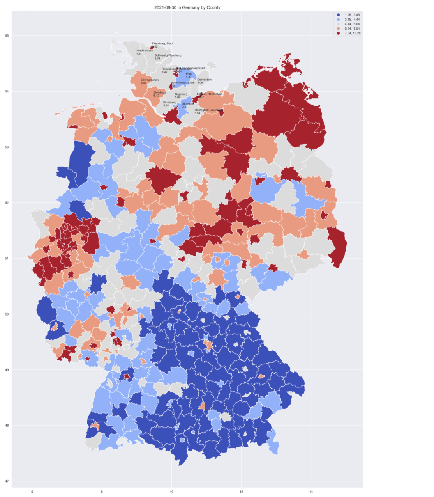
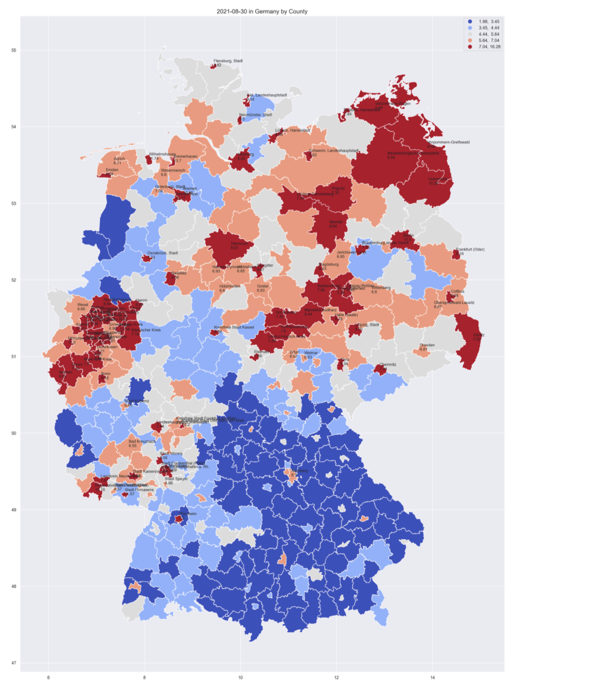
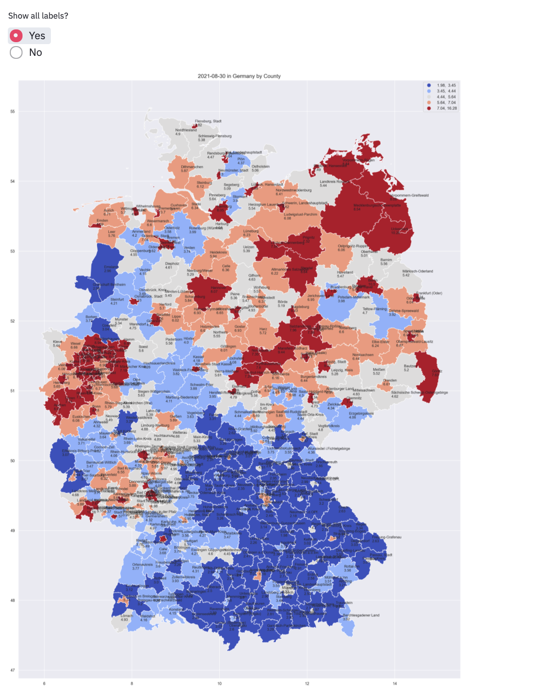

# Visualizations Page 

This section allowas you to on see visualizations of the model results.

## Predictions Line Plot
A time series of the predictions of each kreis can be plotted. For that, you need to chose a kreis from the drop down menu, or type its name. Then the unemployment rate predictions will be printed, and a time series graph will be plotted. 

The graph shows on the ground truth unemployment rates in blue, 
and the predicted values in red.  

It is also possible to choose multiple kreise. 

Then, the unemployment rate predictions for each kreis will be printed separately, 
and a time series graph for all kreise will be plotted. 

The graph shows the values of each kreis in a different line. The ground truth unemployment rates in different colors on the left,  and the predicted values in red on the right. 

## Predictions Map

### Choose varaible to plot map 

Another option is to plot the unemployment rates on a map of Germany. 

First, you need to choose which unemployment rate to plot. 

The options are: 

- A specific ground truth month

- A specific predicted month

- Difference in unemployment rate compared to last month

- Difference in unemployment rate compared to this month last year 

- Percentage of change in unemployment rate compared to same time last month

- Percentage of change in unemployment rate compared to same time last year

<!-- - An average of the three predicted months  -->

*This is a kreis-level map of Germany based on unemployment rate on predicted for August 2021.*

### Adding labels to the map

You can add the kreis name and unemployment rate of that kreis to the map based on your selection. We offer three selections as detailed above, which can be used together.

#### add labels based on bundesland  

After choosing a column, it is also possible to add labels of a specific bundesland to the plot. For that, change the "show labels by region" to "Yes", and choose a bundesland from the drop down menu or type its name. The labels of the kreise of this bundesland will be added to the map. 

*For example, the default adds kreis name and unemployment rates for the kreis Schleswig-Holstein.*

#### add labels based on value 

Alternatively, it is also possible to add kreise labels to the plot based on their values. 
For that, change the "show labels by stats" to "Yes", and choose a which values to show. The labels of the kreise  whose values are between these values will be added to the map. 

*For example, the default adds kreis name and unemployment rates for the kreis with its unemployment rate above the third quartile (75%).*

#### add all labels

The last option is to add the labels of all kreis. For that, change the "show all labels" to "Yes", and all kreis labels will be shown. 

